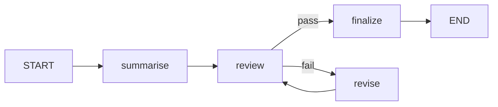

# GP Diagnostic Aide

Clinical decision-support prototype for ENT pathways (ears, noses, throats/necks). Includes a pilot app with a structured decision flow, AI-generated GP summary, and PDF export.

## Overview

This repository contains the marketing site and the pilot application for GP Diagnostic Aide. The pilot app guides clinicians through symptom-based pathways and produces a structured summary draft using LangChain + LangGraph with an OpenAI model.

## Features

- Landing page with project overview and collaboration context
- Pilot app at `/pilot`
- Sequential symptom screening for ears (single + combo logic)
- AI summary generation (Markdown) with `gpt-4o-mini`
- PDF export of the clinical note (client-side)
- Voice shortcut to select ears / nose / throat+neck pathways

## Tech Stack

- Next.js (App Router)
- TypeScript
- Tailwind CSS
- LangChain v1 + LangGraph
- OpenAI API
- Vercel (hosting and deployments)

## Architecture (high level)

```mermaid
flowchart LR
  clinician[Clinician] --> ui[Next.js UI]
  ui --> api[/api/summary]
  api --> llm[LangChain + LangGraph]
  llm --> openai[OpenAI]
```

## LLM Pattern

The pilot app uses a **reflexion pattern** (review‑revise loop) implemented in LangGraph:

1. `summarise` drafts the Markdown clinical note.
2. `review` validates the draft against strict formatting and content constraints.
3. If review fails, `revise` rewrites and loops back to `review` (max 2 revisions).
4. `finalize` returns the latest draft.

This pattern is chosen to enforce consistent structure, wording, and compliance with clinical note requirements.



## Documentation

Setup and deployment notes live in `guides/setup.md`.
